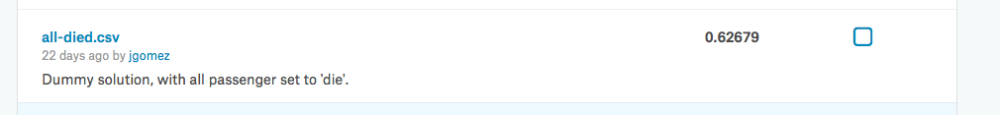

Preprocesamiento de datos con el dataset [titanic](https://www.kaggle.com/c/titanic/).

> El hundimiento del Titanic es una de las tragedias marítimas más conocidas de la historia. El 15 de abril de 1912, durante su viaje inaugural, el Titanic se hundió después de chocar contra un iceberg. En el accidente murieron 1502 personas de las 2224 que habían embarcado, inluyendo pasajeros y tripulación. Una de las razones por las que no se encontraron más supervivientes fue la falta de espacio en los barcos salvavidas. Así, aunque la suerte sin duda sonrió a los supervivientes, también resultaron más favorecidos algunos grupos de personas, como las mujeres, los niños y los pasajeros de la clase superior.

**En este problema analizaremos qué tipos de personas tuvieron más probabilidades de sobrevivir. Para ello, aplicaremos técnicas de aprendizaje automático que nos permitirán predecir qué pasajeros sobrevivieron al hundimiento.**

En primer lugar, nos centraremos en el pre-procesamiento de los datos utilizando [tidyverse](https://www.tidyverse.org), una colección de paquetes de R para Ciencia de Datos. En el libro _[R for Data Science](http://r4ds.had.co.nz)_ podemos encontrar documentación detallada sobre [tidyverse](https://www.tidyverse.org). A continuación pasaremos a estudiar la creación de modelos de clasificación con [<tt>caret</tt>](http://topepo.github.io/caret/). En el libro _[Applied Predictive Modeling](https://link.springer.com/book/10.1007%2F978-1-4614-6849-3)_ (gratuito desde RedUGR) podemos encontrar documentación detallada sobre [<tt>caret</tt>](http://topepo.github.io/caret/).

<br/>
**Índice**

* [Lectura de datos](#Lectura de datos)
* [Estado del conjunto de datos](#Estado del conjunto de datos)
* [Predictor básico: todos los pasajeros mueren](#Predictor básico: todos los pasajeros mueren)
* [Predictor refinado: todos los hombres mueren](#Predictor refinado: todos los hombres mueren)
* [Predictor refinado: todos los hombres mueren, las mujeres en 3ª clase que pagan igual o más de 20 mueren](#Predictor refinado: todos los hombres mueren, las mujeres en 3ª clase que pagan igual o más de 20 mueren)
* [Predicción automática](#Predicción automática)

## Lectura de datos 
Comenzaremos utilizando el fichero [_train.csv_](https://www.kaggle.com/c/titanic/data) de Kaggle, donde encontramos los datos de 891 pasajeros y que utilizaremos para crear nuestro modelo de predicción.

Para lectura de datos, utilizaremos alguna de las variantes de la función [<tt>read_</tt>](http://r4ds.had.co.nz/data-import.html). A continuación, podemos inspeccionar el contenido de la tabla de datos, que se almacena en formato [<tt>tibble</tt>](http://r4ds.had.co.nz/tibbles.html).

```{r}
library(tidyverse)
data_raw <- read_csv('train.csv')
data_raw # str(data_raw) , glimpse(data_raw)
```

## Estado del conjunto de datos
Podemos identificar los valores perdidos de la tabla utilizando <tt>df_status</tt>, del paquete [<tt>funModeling</tt>](https://livebook.datascienceheroes.com/exploratory-data-analysis.html#dataset-health-status).
```{r}
library(funModeling)
df_status(data_raw)
```
Algunas observaciones interesantes:

* Los valores de _PassengerId_ y _Name_ son únicos
* Existen dos valores diferentes para _Survived_, que es nuestro objetivo de clasificación
* No sobrevivieron 549 pasajeros (61.62%)
* Aparecen numerosos valores perdidos (_na_) en las variables _Age_ y _Cabin_

Parte de estas situaciones se pueden identificar y procesar directamente manipulando la tabla <tt>df_status</tt>:
```{r}
status <- df_status(data_raw)

## columnas con NAs
na_cols <- status %>%
  filter(p_na > 70) %>%
  select(variable)
## columnas con valores diferentes
dif_cols <- status %>%
  filter(unique > 0.8 * nrow(data_raw)) %>%
  select(variable)

## eliminar columnas
remove_cols <- bind_rows(
  list(na_cols, dif_cols)
)
data_reduced <- data_raw %>%
  select(-one_of(remove_cols$variable))
```

## Predictor básico: todos los pasajeros mueren
### Tablas
A continuación, nos centramos en los valores de la variable _Survived_. Podemos obtener un resumen en forma de tabla utilizando <tt>table</tt>, que muestra un recuento basado en la variable(s) usada como argumento. De forma similar, <tt>prop.table</tt> muestra un recuento normalizado al intervalo [0, 1]. 
```{r}
table(data_raw$Survived)
prop.table(table(data_raw$Survived))
```
### Realizar predicción con datos de test (1)
Dado que alrededor del 60% de los pasajeros mueren, podemos asumir un clasificador muy sencillo que asigna a todos los pasajeros _Survived = 0_. Con este clasificador esperamos una tasa de acierto correspondiente del 60%.

Para ello, vamos a leer el fichero _test.csv_, seleccionar solo la columna _PassengerId_ y asignar 0 a _Survived_, utilizando dos funcionalidades de <tt>dplyr</tt>:

* [Pipes](http://r4ds.had.co.nz/pipes.html): Permiten encadenar operaciones de transformación utlizando <tt>%>%</tt>, de forma similar al operador | en bash.

* [Funciones de transformación de datos](http://r4ds.had.co.nz/transform.html): Permiten generar una nueva tabla de datos a partir de la tabla recibida como primer argumento o a través del _pipe_. Emplearemos [<tt>select</tt>](http://r4ds.had.co.nz/transform.html#select-columns-with-select) (para selección de columnas) y [<tt>mutate</tt>](http://r4ds.had.co.nz/transform.html#add-new-variables-with-mutate) (para generar nuevas columnas o modificar las ya existentes).

La tabla de datos obtenidas, que mostramos utilizando _()_, se guarda en el fichero _all-died.csv_, que enviaremos como _submission_ a la [competición de Kaggle](https://www.kaggle.com/c/titanic/submit).

```{r}
(test <- 
  read_csv('test.csv') %>%
  select(one_of('PassengerId')) %>%
  mutate(Survived = 0)
)
write_csv(test, "all-died.csv")
```


## Predictor refinado: todos los hombres mueren
### Filtrado de datos
Si filtramos las filas de los pasajeros que sobrevivieron, observamos que los datos indican una mayor cantidad de mujeres entre los supervivientes. 
```{r}
filtered <-
  data_raw %>%
  filter(Survived == 1) %>%
  arrange(Age)
```

De hecho, podemos verlo con la función <tt>table</tt>. En este caso, el primer argumento es la variable que se utiliza para las filas y el segundo argumento la variable que se utiliza para las columnas. La tabla indica que, por ejemplo, de todos los pasajeros del barco, un 52% eran hombres que murieron.
```{r}
prop.table(table(data_raw$Sex, data_raw$Survived))
```
### Histogramas
También podemos dibujar un histograma de los datos utilizando [<tt>ggplot</tt>](http://r4ds.had.co.nz/data-visualisation.html).

[<tt>ggplot</tt>](http://r4ds.had.co.nz/data-visualisation.html) es un paquete de visualización de datos muy completo que ofrece una gramática para construir gráficos de una manera semi-declarativa, especificando las propiedades de las diferentes capas visuales.

Generalmente, en la instrucción <tt>ggplot</tt> especificamos las características comunes para todo el gráfico, incluyendo el conjunto de datos que vamos a visualizar. Las capas visuales, como por ejemplo el histograma <tt>geom_histogram</tt>, se añaden al gráfico general. Cada una de las capas puede establecer a su vez diferentes parámetros visuales mediante el argumento <tt>aes</tt>. En este caso, estamos indicando que queremos que las barras del histograma se coloreen según el valor de la variable _Survived_ (parámetro _fill_).

```{r}
library(ggplot2)
ggplot(data_raw) +
  geom_histogram(aes(x = Age, fill = as.factor(Survived)), binwidth = 1)
```
Podemos modificar el formato del gráfico: paleta de colores, etiquetas, etc. utilizando <tt>ggthemes</tt> y <tt>scales</tt>.
```{r}
library(ggthemes)
library(scales)
plotdata <- 
  data_raw %>%
  mutate(Survived = as.factor(Survived))
ggplot(plotdata) +
  geom_histogram(aes(x = Age, fill = Survived), binwidth = 1) +
  labs(title = "Titanic survivors", x = "Age", y = "# Passengers", fill = "Survived") +
  theme_hc() + scale_fill_hc(labels = c('Yes', 'No'))
```
Si mostramos únicamente el histograma para los pasajeros que sobrevivieron, la relación se ve aún más clara. En el siguiente gráfico hemos modificado el parámetro _bindwidth_, de forma que agrupamos los pasajeros por tramos de edad más amplios.
```{r}
ggplot(filter(data_raw, Survived == 1)) +
  geom_histogram(aes(x = Age, fill = as.factor(Sex)), binwidth = 15)
```

### Estudio de correlaciones
Para comprobar numéricamente la relación entre las variables, incluyendo _Sex_ y _Survived_, realizamos un estudio de correlaciones con <tt>correlation_table</tt>. Atención, porque esta función necesita que los datos estén expresados de forma numérica.
```{r}
correlation_table(data_raw, target='Survived')

d <- 
  data_raw %>%
  mutate(Sex_Num = ifelse(Sex == 'male', 0, 1))

cor(d$Survived, d$Sex_Num)
```
### Realizar predicción con datos de test (2)
La predicción de 'todos los hombres mueren' es sencilla de obtener asignando el valor de _Survived_ según el valor de _Sex_ mediante <tt>ifelse</tt>.
```{r}
(test <- 
  read_csv('test.csv') %>%
  mutate(Survived = ifelse(Sex == 'female', 1, 0)) %>%
  select(one_of('PassengerId', 'Survived'))
)
write_csv(test, "men-died.csv")
```
Los resultados en Kaggle de esta predicción son algo mejores que los obtenidos con la predicción anterior.


## Predictor refinado: todos los hombres mueren, las mujeres en 3ª clase que pagan igual o más de 20 mueren
### Transformación de datos
En la sección anterior hemos visto que existen otras variables correladas con _Survived_; además de _Sex_, tenemos _Fare_ y _Pclass_. Ambas son indicativas del nivel económico de los pasajeros. 
```{r}
cor(d$Pclass, d$Fare)
```
Podemos estudiar _Pclass_ para comprobar si es así, por ejemplo creando un histograma con esta variable en el eje x. En este caso utilizarmos un <tt>geom_bar</tt>, que también por defecto realiza un recuento de ocurrencias.
```{r}
ggplot(data_raw) +
  geom_bar(aes(x = Pclass, fill = as.factor(Survived)))
```
Efectivamente, _Pclass_ es también determinante para la supervivencia, como ya sabíamos que ocurría con _Sex_. Por lo tanto, parece conveniente estudiar la influencia conjunta de ambas variables en la predicción. Una forma de hacerlo es construir una tabla que nos muestre las tasas de supervivencia por sexo y clase. Utilizamos para ello las funciones de <tt>dplyr</tt>:

* Resumen: La función [<tt>summarise</tt>](http://r4ds.had.co.nz/transform.html#grouped-summaries-with-summarise) permite realizar operaciones de resumen sobre el conjunto de datos: agregaciones, sumas, etc.

* Agrupación: La función [<tt>group_by</tt>](http://r4ds.had.co.nz/transform.html#grouping-by-multiple-variables) permite agrupar los datos en bloques, a los que se aplica individualmente el <tt>summarise</tt>.

A continuación se muestran dos ejemplos sencillos de <tt>group_by</tt> y <tt>summarise</tt>, que ilustran respectivamente: (1) cómo obtener la edad media por clase (2) % de supervivencia respecto al total por clase y sexo.
```{r}
data_raw %>%
  group_by(Pclass) %>%
  summarise(AvgAge = mean(Age, na.rm = TRUE) )

data_raw %>%
  group_by(Pclass, Sex) %>%
  summarise(Survived_G = sum(Survived) / length(Survived) )
```
Finalmente, se presenta el código para la tabla de tasas de superviviencia por sexo, clase y precio del billete. Para facilitar el cálculo, se han creado varios intervalos de precios mediante [<tt>case_when</tt>](https://www.rdocumentation.org/packages/dplyr/versions/0.7.3/topics/case_when), que permite implementar múltiples condiciones de tipo if-else de manera simple.
```{r}
data_raw %>%
  filter(!is.na(Fare)) %>%
  mutate(Fare_Interval = case_when(
    Fare >= 30 ~ '30+',
    Fare >= 20 & Fare < 30 ~ '20-30',
    Fare < 20 & Fare >= 10 ~ '10-20',
    Fare < 10 ~ '<10')) %>%
  group_by(Fare_Interval, Pclass, Sex) %>%
  summarise(Survived_G = sum(Survived) / length(Survived)) %>%
  filter(Survived_G > 0.0) %>%
  arrange(Pclass, desc(Survived_G))
```

### Realizar predicción con datos de test (3)
Esta predicción establece que mueren todos los hombres y las mujeres en tercera clase (que pagaron más de 20$, que se añade como condición adicional).
```{r}
(test <- 
  read_csv('test.csv') %>%
  mutate(Survived = case_when(
    Sex == 'female' & Pclass == 3 & Fare >= 20 ~ 0,
    Sex == 'male' ~ 0,
    TRUE ~ 1)) %>%
  select(one_of('PassengerId', 'Survived'))
)
write_csv(test, "men-and-some-women-died.csv")
```


## Predicción automática
Los modelos de predicción anteriores expresan un conjunto de reglas heurísticas obtenidas mediante análisis exploratorio de los datos (EDA, en inglés). Para crear un modelo de clasificación de forma automática utilizaremos  [<tt>caret</tt>](http://topepo.github.io/caret/). Este paquete es un _wrapper_ para numerosos algoritmos de aprendizaje automático, ofreciendo una API simple y unificada. 

En este ejemplo utilizamos árboles de regresión (CART, _classification and regression trees_) con [<tt>rpart</tt>](https://rpubs.com/jboscomendoza/arboles_decision_clasificacion). Estos árboles admiten un solo parámetro denominado _cp_ y que denota la complejidad permitida para los árboles resultado --una medida calculada a partir de la profundidad, la amplitud y el número de variables del árbol.

### Preprocesamiento
Antes de realizar la predicción automática, se realizan varias tareas sencillas de preprocesamiento:

* Codificación de variables: _Survived_ = {'Yes', 'No'}, _Pclass_ = <tt>factor</tt>
* Discretización de variables numéricas: _Fare\_Interval_ = {'More.than.30', 'Between.20.30', 'Between.10.20', 'Less.than.10'}
* Selección de variables: solo se consideran para la predicción: _Survived_ (variable objetivo), _Pclass_, _Sex_, _Fare_Interval_

```{r}
library(caret)
data <-
  data_raw %>%
  mutate(Survived = as.factor(ifelse(Survived == 1, 'Yes', 'No'))) %>%
  mutate(Pclass = as.factor(Pclass)) %>%
  mutate(Fare_Interval = as.factor(
    case_when(
      Fare >= 30 ~ 'More.than.30',
      Fare >= 20 & Fare < 30 ~ 'Between.20.30',
      Fare < 20 & Fare >= 10 ~ 'Between.10.20',
      Fare < 10 ~ 'Less.than.10'))) %>%
  select(Survived, Pclass, Sex, Fare_Interval)
```

### Parámetros del algoritmo de aprendizaje
Una vez preparados los datos, se definen los parámetros del algoritmo de aprendizaje con [<tt>trainControl</tt>](https://topepo.github.io/caret/model-training-and-tuning.html#control). En este caso, la implementación de CART en [<tt>caret</tt>](http://topepo.github.io/caret/) solo tiene un parámetro _cp_ (complejidad del árbol), que suele configurarse con valores entre 0 y 0.1. El _grid_ de parámetros se especifica utilizando la función [<tt>expand.grid]</tt>(https://topepo.github.io/caret/model-training-and-tuning.html#grids), el nombre del parámetro (_cp_, en este caso) y, a continuación, un vector o una lista de valores.

```{r}
rpartCtrl <- trainControl(classProbs = TRUE)
rpartParametersGrid <- expand.grid(.cp = c(0.01, 0.05)) # se pide que se prueben con la lista de valores .cp = {0.01, 0.05}
```

### Conjuntos de entrenamiento y validación
A continuación, se crean los conjuntos de entrenamiento y validación utilizando [<tt>createDataPartition</tt>](https://rdrr.io/rforge/caret/man/createDataPartition.html). En este caso utilizaremos 70% para entrenamiento (30% para validación) con selección aleatoria. El resultado de [<tt>createDataPartition</tt>](https://rdrr.io/rforge/caret/man/createDataPartition.html) es un vector (<tt>list = FALSE</tt>) con los números de fila que se han seleccionado para el entrenamiento.

```{r}
set.seed(0)
trainIndex <- createDataPartition(data$Survived, p = .7, list = FALSE)
train <- data[trainIndex, ] 
val   <- data[-trainIndex, ]
```

### Entrenamiento del modelo
Una vez listos todos los elementos necesarios para el entrenamiento, podemos utilizar [<tt>train</tt>]. En este caso, queremos predecir _Survived_ a partir del resto de variables: <tt>Survived ~ .</tt>. La métrica para estudiar la calidad del clasificar es la precisión (<tt>Accuracy</tt>).
```{r}
rpartModel <- train(Survived ~ ., 
                    data = train, 
                    method = "rpart", 
                    metric = "Accuracy", 
                    trControl = rpartCtrl, 
                    tuneGrid = rpartParametersGrid)
```

El modelo de predicción se almacena en el objeto generado por <tt>train</tt>, junto a otros valores relevantes, como las métricas de entrenamiento. En este ejemplo se puede ver que el <tt>Accuracy</tt> obtenido con _cp_ = 0.01 es más alto que con 0.05; por tanto, el modelo final será el primero.
```{r}
rpartModel
```

El árbol de decisión se almacena en rpartModel$finalModel y puede visualizarse como conjunto de reglas. *NOTA*: Hay que tener en cuenta que, por defecto, rpart utiliza variables '[dummy](https://miro.medium.com/max/2182/1*LkfPVrhoF_TLSeSXzhB8sA.png)' para codificar las variables categóricas como variables binarias.
```{r}
rpartModel$finalModel
```

Además, apoyándonos en [<tt>rpart.plot</tt>](http://www.milbo.org/rpart-plot/prp.pdf), podemos visualizar el árbol de decisión y el modelo de reglas obtenido. 
```{r}
library(rpart.plot)
rpart.plot(rpartModel$finalModel)
```

### Validación del modelo
Una vez entrenado el modelo, podemos realizar predicciones, tanto 'en crudo' (salida: _Yes_, _No_) como con probabilidad de supervivencia. Con las predicciones 'en crudo' podemos generar una matriz de confusión. Con las predicciones como probabilidades, se podría establecer un umbral a partir del cual se predice _Yes_ y por debajo _No_.
```{r}
prediction <- predict(rpartModel, val, type = "raw") 
cm_train <- confusionMatrix(prediction, val[["Survived"]])
cm_train
```
```{r}
prediction <- predict(rpartModel, val, type = "prob") 
```

### Test del modelo
Podemos, finalmente, tomar el modelo y generar la predicción para los datos de test a partir de las columnas (_Pclass_, _Sex_, _Fare\_Interval_).
```{r}
data_test_raw <- read_csv('test.csv')
test <- 
  data_test_raw %>%
  mutate(Pclass = as.factor(Pclass)) %>%
  mutate(Fare_Interval = as.factor(
    case_when(
      Fare >= 30 ~ 'More.than.30',
      Fare >= 20 & Fare < 30 ~ 'Between.20.30',
      Fare < 20 & Fare >= 10 ~ 'Between.10.20',
      Fare < 10 ~ 'Less.than.10',
      TRUE ~ 'Between.10.20')))
prediction <- predict(rpartModel, test, type = "raw")

prediction_table <- 
  select(test, PassengerId) %>%
  mutate(Survived = 
           ifelse(prediction=='Yes', 1, 0)) 
   
write_csv(prediction_table, "caret-classification-basic.csv")
```

### Medidas alternativas
Podemos considerar también otras medidas de calidad del clasificador para su uso dentro de <tt>train</tt>; por ejemplo, ROC. Para ello necesitamos añadir en el <tt>trainControl</tt> la función predefinida <tt>twoClassSummary</tt>, que calcula varias estadísticas necesarias para la métrica ROC.
```{r}
rpartCtrl <- trainControl(classProbs = TRUE, summaryFunction = twoClassSummary)
rpartModel <- train(Survived ~ ., 
                    data = train, 
                    method = "rpart", 
                    metric = "ROC",
                    trControl = rpartCtrl, 
                    tuneGrid = rpartParametersGrid)
rpartModel
```

También podemos calcular la curva ROC para las predicciones del modelo sobre los datos de validación utilizando el paquete [<tt>pROC</tt>](https://web.expasy.org/pROC/). El paquete incluye dos funcionalidades principales: <tt>auc</tt> para crear la curva y <tt>plot.roc</tt> para visualizarla.

El gráfico resultante muestra la curva ROC, el valor de corte para la probabilidad que optimiza el valor ROC y los valores de _specificity_ y _sensitivity_ resultantes.
```{r}
library(pROC)
predictionValidationProb <- predict(rpartModel, val, type = "prob")
auc1 <- roc(val$Survived,                       # columna 'target' del conjunto de entrenamiento
           predictionValidationProb[["Yes"]])  # columna de predicciones de la clase positiva como probabilidades
roc_validation1 <- plot.roc(auc1, 
                           ylim=c(0,1), 
                           type = "S" , 
                           print.thres = TRUE, 
                           main=paste('Validation AUC:', round(auc1$auc[[1]], 2)))
```

### Validación cruzada
[<tt>caret</tt>](http://topepo.github.io/caret/) incorpora la posibilidad de aplicar cross-validation a través del objeto <tt>trainControl</tt> con <tt>method</tt> y especificando el número de particiones con <tt>number</tt>. En este ejemplo no hay diferencias de validación entre utilizar validación cruzada y no utilizarla, aunque normalmente sí las habrá.
```{r}
rpartCtrl <- trainControl(verboseIter = TRUE, classProbs = TRUE, summaryFunction = twoClassSummary, method = "cv", number = 10)
rpartModel <- train(Survived ~ ., 
                    data = train, 
                    method = "rpart", 
                    metric = "ROC", 
                    trControl = rpartCtrl, 
                    tuneGrid = rpartParametersGrid)
predictionValidationProb <- predict(rpartModel, val, type = "prob")
auc2 <- roc(val$Survived, predictionValidationProb[["Yes"]])
roc_validation2 <- plot.roc(auc2, 
                           ylim=c(0,1), 
                           type = "S" , 
                           print.thres = TRUE, 
                           main=paste('Validation AUC:', round(auc2$auc[[1]], 2)))
```

## Otras técnicas
Podemos utilizar otras técnicas, como Random Forest, siguiendo el mismo esquema. Si no especificamos un 'grid' se utilizarán los valores por defecto.
```{r}
rfModel <- train(Survived ~ ., data = train, method = "rf", metric = "ROC", trControl = rpartCtrl)
predictionValidationProb <- predict(rfModel, val, type = "prob")
auc3 <- roc(val$Survived, predictionValidationProb[["Yes"]], levels = unique(val[["Survived"]]))
roc_validation3 <- plot.roc(auc3, ylim=c(0,1), type = "S" , print.thres = T, main=paste('Validation AUC:', round(auc3$auc[[1]], 2)))
```

Y comparar resultados...
```{r}
roc.test(roc_validation3, roc_validation2)

plot.roc(auc2, type = "S", col="#1c61b6")
lines.roc(auc3, type = "S", col="#008600")
```

<script type="text/javascript">
  <!-- https://stackoverflow.com/questions/39281266/use-internal-links-in-rmarkdown-html-output/39293457 -->
  // When the document is fully rendered...
  $(document).ready(function() {
    // ...select all header elements...
    $('h1, h2, h3, h4, h5').each(function() {
      // ...and add an id to them corresponding to their 'titles'
      $(this).attr('id', $(this).html());
    });
  });
</script>
